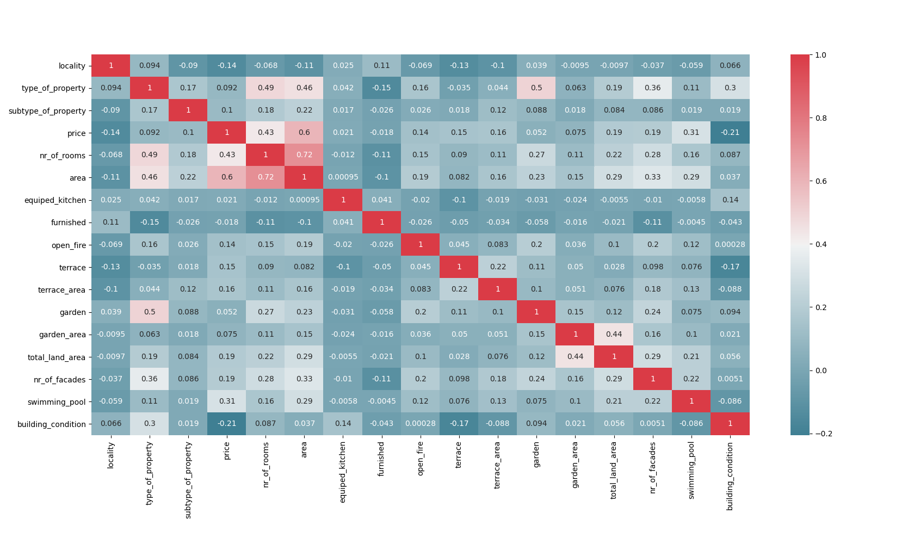
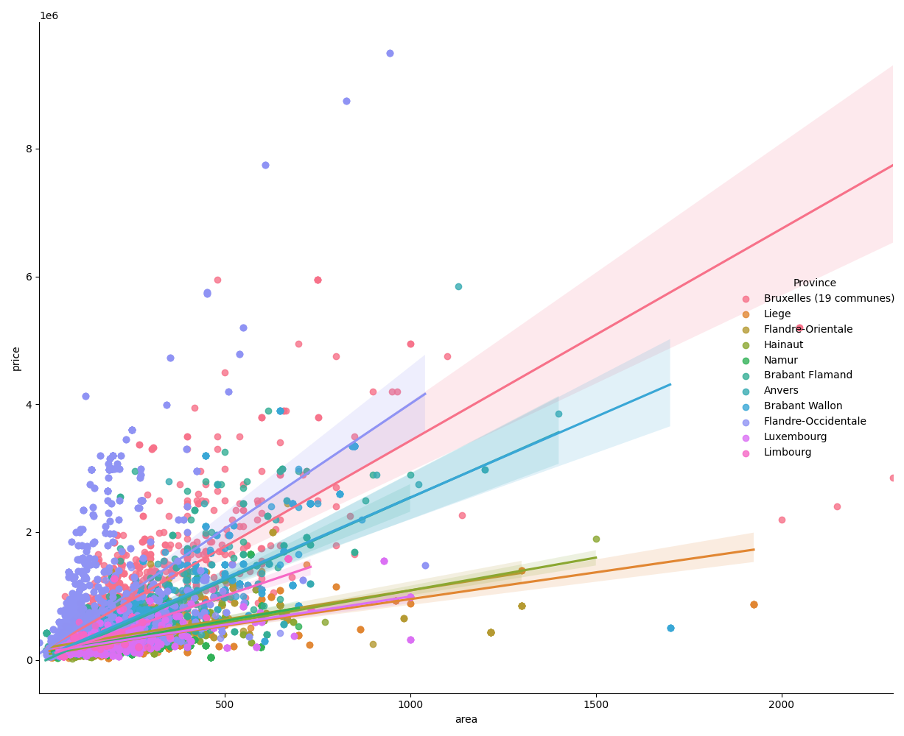
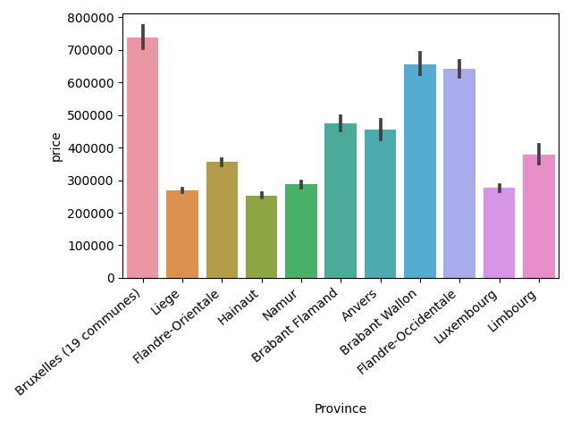

# challenge-data-analysis

## Team members - Contributors

* [Lise Amen](https://github.com/lise-amen)
* [Pierre Wasilewski](https://github.com/pierrewasilewski)
* [Jonathan Decleire](https://github.com/JonathanDecleire)

## Purpose
Perform data analysis on the data set that was collected in the previous challenge when we scraped Belgian real estate listings from Immoweb.

## Objectives
   - Be able to use pandas.
   - Be able to use Data visualisation libraries.(matplotlib or seaborn)
   - Be able to clean a dataset for analysis
   - Be able to establish conclusions about a dataset.
   - Be able to find and answer creative questions about data
   - Be able to think outside the box


## Why
We are analyzing this data for a fictitious real estate company who wants to create a machine learning model to make price predictions on real estate sales in Belgium.

## How
### Step 1: Data cleaning
    [x] No duplicates
    [x] No blank spaces (ex: " I love python " => "I love python")
    [x] No errors
    [x] No empty values

### Step 2: Data analysis
    Which variable is the target ? --> Price
    How many rows and columns ? --> 7611 x 20
    What is the correlation between the variables and the target ? (Why might that be?)
    

      
    What is the correlation between the variables and the other variables ? (Why?)
    
    Which variables have the greatest influence on the target ?
    area, nr_of_rooms
    Which variables have the least influence on the target ?
    
    How many qualitative and quantitative variables are there ? How would you transform these values into numerical values ?
      Quantitative: 'price','nr_of_facades','nr_of_rooms', 'area', 'terrace_area', 'garden_area', 'total_land_area'
      Qualitative: 'locality', 'type_of_property', 'subtype_of_property', 'type_of_sale', 'equiped_kitchen', 'furnished', 'open_fire', 'terrace', 'garden', 'swimming_pool',           'building_condition'
    subtype_of_property
    Percentage of missing values per column ?


### Step 3: Data interpretation
    Are there any outliers? If yes, which ones and why?
   

    
    In your opinion, which 5 variables are the most important and why?
      - price
      - number of rooms
      - area
      - swimming pool
      - building condition
      
    --> Highest correlation with our price variable.
      
    
    Which variables would you delete and why ?
      - fireplace
      - subtype of property
      - garden
      - garden area
      
    --> Lowest correlations with our price variable.
    
    
    Creation of a new file belgian_postal_codes.csv to match the locality info in our data set with its location in a province and region of Belgium.
    Creation of two new columns in the dataset: Province and Region
    
    
  
    
    What are the most expensive municipalities in Belgium? (Average price, median price, price per square meter)
    What are the most expensive municipalities in Wallonia? (Average price, median price, price per square meter)
    What are the most expensive municipalities in Flanders? (Average price, median price, price per square meter)
    What are the less expensive municipalities in Belgium? (Average price, median price, price per square meter)
    What are the less expensive municipalities in Wallonia? (Average price, median price, price per square meter)
    What are the less expensive municipalities in Flanders? (Average price, median price, price per square meter)



## Run
To run this application, launch
```python
python main.py
```
## Data analysis file


## Requirements


## Possible improvements

Dividing the dataset by property type(houses and apartments) and see whether the correlation values change.

## When

3 days to complete (02/12/2020 -- 07/12/2020)
